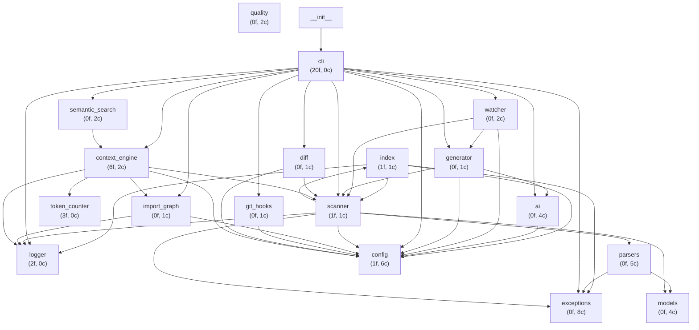

# Architecture Diagram

```mermaid
graph TB
    index["index\n(1f, 1c)"]
    ai["ai\n(0f, 4c)"]
    models["models\n(0f, 4c)"]
    watcher["watcher\n(0f, 2c)"]
    quality["quality\n(0f, 2c)"]
    exceptions["exceptions\n(0f, 8c)"]
    logger["logger\n(2f, 0c)"]
    generator["generator\n(0f, 1c)"]
    parsers["parsers\n(0f, 5c)"]
    cli["cli\n(20f, 0c)"]
    semantic_search["semantic_search\n(0f, 2c)"]
    __init__["__init__"]
    scanner["scanner\n(1f, 1c)"]
    token_counter["token_counter\n(3f, 0c)"]
    config["config\n(1f, 6c)"]
    import_graph["import_graph\n(0f, 1c)"]
    git_hooks["git_hooks\n(0f, 1c)"]
    diff["diff\n(0f, 1c)"]
    context_engine["context_engine\n(6f, 2c)"]

    index --> exceptions
    index --> logger
    index --> config
    index --> scanner
    ai --> config
    watcher --> config
    watcher --> scanner
    watcher --> generator
    generator --> config
    generator --> scanner
    generator --> ai
    parsers --> exceptions
    parsers --> models
    cli --> config
    cli --> scanner
    cli --> generator
    cli --> watcher
    cli --> ai
    cli --> git_hooks
    cli --> logger
    cli --> exceptions
    cli --> semantic_search
    cli --> context_engine
    cli --> import_graph
    cli --> diff
    semantic_search --> context_engine
    __init__ --> cli
    scanner --> exceptions
    scanner --> logger
    scanner --> parsers
    scanner --> models
    scanner --> config
    scanner --> index
    import_graph --> logger
    import_graph --> config
    git_hooks --> config
    diff --> config
    diff --> scanner
    context_engine --> token_counter
    context_engine --> logger
    context_engine --> config
    context_engine --> scanner
    context_engine --> import_graph
```

*Generated by know*