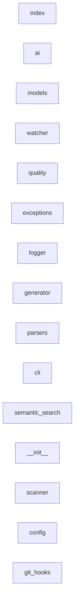

# Dependency Graph

```mermaid
graph LR
    index[index]
    ai[ai]
    models[models]
    watcher[watcher]
    quality[quality]
    exceptions[exceptions]
    logger[logger]
    generator[generator]
    parsers[parsers]
    cli[cli]
    semantic_search[semantic_search]
    __init__[__init__]
    scanner[scanner]
    config[config]
    git_hooks[git_hooks]
```

*Generated by know*